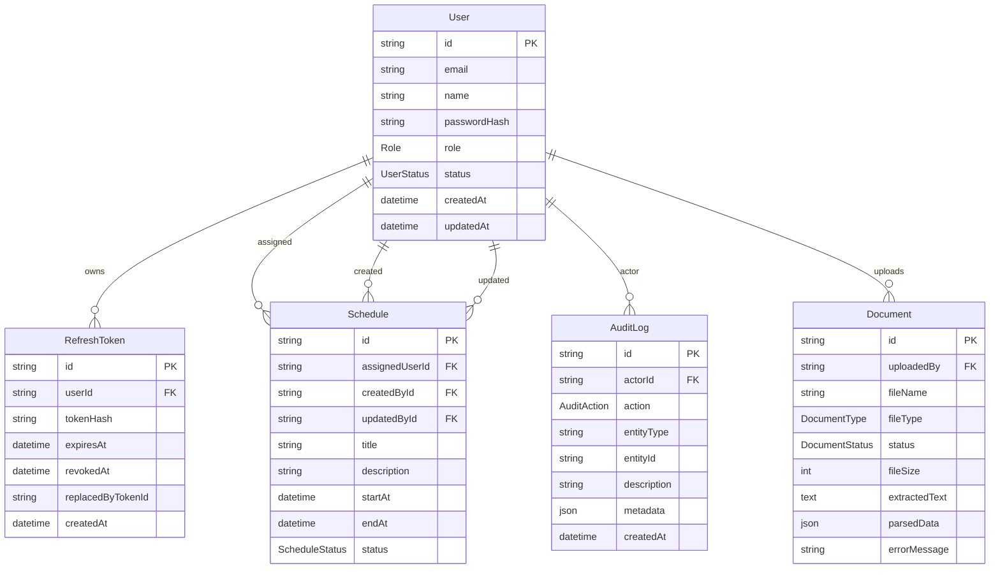
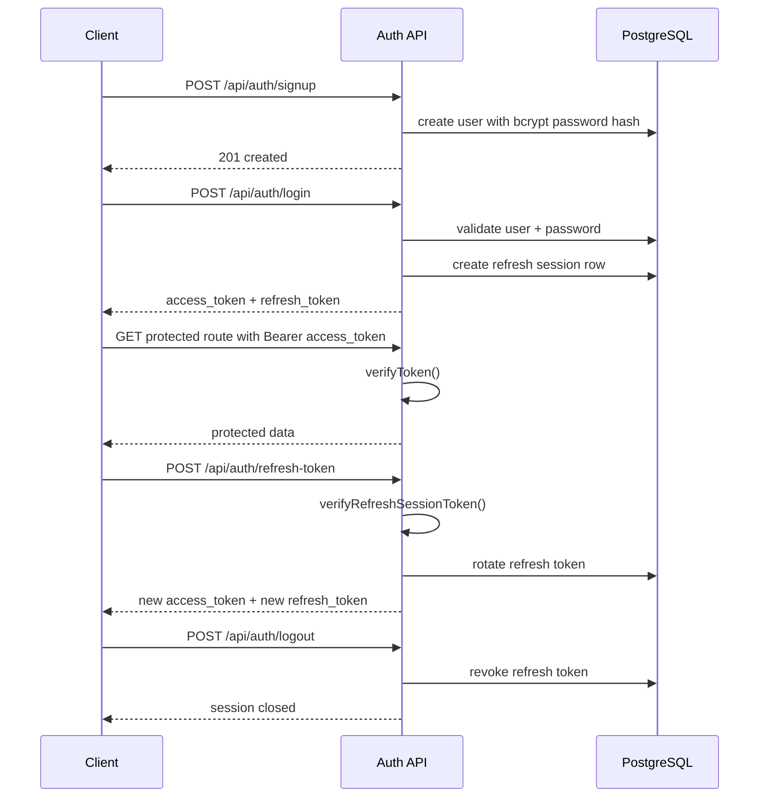

# Delivery Notes

## JWT Middleware

- `src/lib/middleware/auth.ts`
  expone `verifyToken()`, `verifyRefreshSessionToken()`, `requireRole()`,
  `getAccessTokenFromRequest()` y `getRefreshTokenFromRequest()`.
- Las rutas protegidas aceptan `Authorization: Bearer <token>` y mantienen
  compatibilidad con cookies HttpOnly para el frontend actual.
- Los tokens expirados o inválidos responden con `401`.
- Los roles insuficientes responden con `403`.

## ER Diagram

## JWT Flow

