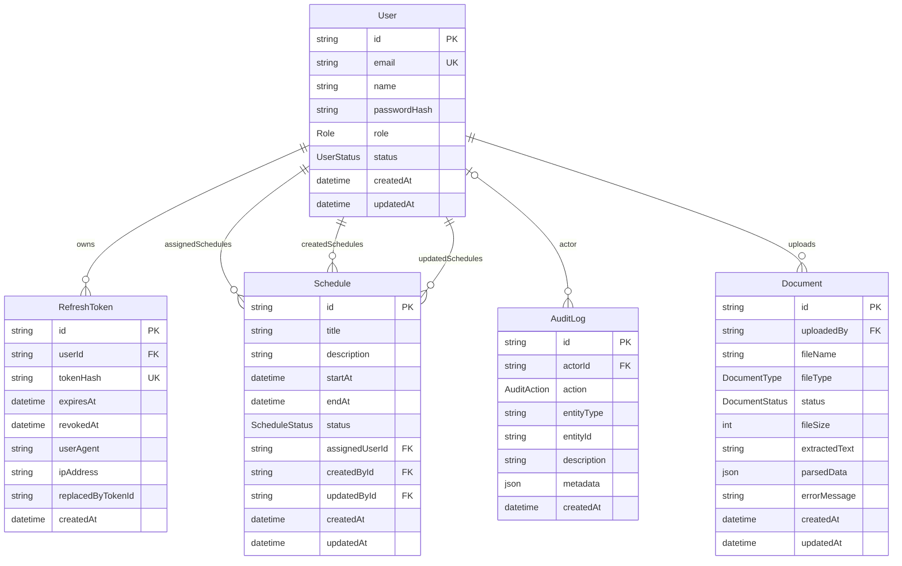

# Entity Relationship Diagram

## Notes

- `User` is the central entity for authentication, scheduling, auditing, and document uploads.
- `Schedule` keeps separate foreign keys for assignee, creator, and last updater.
- `AuditLog` uses `entityType` and `entityId` so one audit table can track multiple resources.
- `RefreshToken` supports token rotation and revocation without storing raw tokens.
